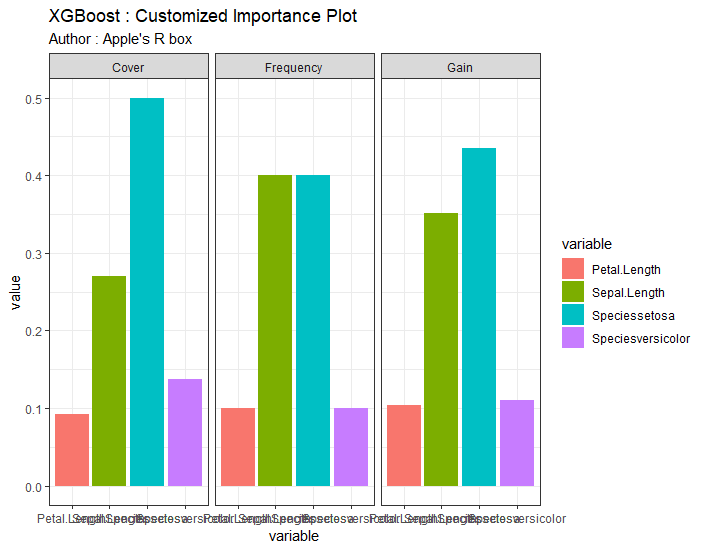

# XGBoost-visualization
some visualization functions for XGBoost in R

## Code Explanation

cv plot : function for visualizing XGBoost cross validation model step-by-step, ggplot based scatter + line plot will be made   

importance plot : function for visualizing xgb.importance object, ggplot based barplot will be made which containns 3 facet grid (Cover, Frequency, Gain)

## Visualization Example

### cv_plot
  

### importance_plot

